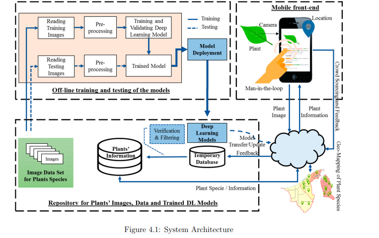

# Medicinal Plant Detection Using Deep Learning

## Project Overview
This project focuses on the **detection of medicinal plants** and their potential to cure diseases using **image processing** and **deep learning techniques**. The goal is to automate the identification of medicinal plants based on their leaf structures. The project employs deep learning models, particularly the **Convolutional Neural Network (CNN)**, to enhance accuracy in plant identification.

## Table of Contents
- [Features](#features)
- [Installation](#installation)
- [Usage](#usage)
- [Models Used](#models-used)
- [Dataset](#dataset)
- [Results](#results)
- [Applications](#applications)
- [Future Work](#future-work)
- [System Architecture](#System-Architecture)
- [Implementation](#Implementation)
- [License](#license)

## Features
- Automatic **identification of medicinal plants** from leaf images.
- Integration of **deep learning models** like CNN, VGG-19, and DenseNet for better accuracy.
- Image preprocessing and augmentation for enhanced model performance.
- **Voice recognition** feature for easier access, especially for users with visual impairments.
- **Regional language support** for user-friendly interactions.
  
## Installation

### Prerequisites
- Python 3.x
- TensorFlow, Keras, OpenCV, NumPy, Flask, and other dependencies mentioned in `requirements.txt`.

### Clone the Repository
```bash
git clone https://github.com/your_username/medicinal-plant-detection.git
cd medicinal-plant-detection
```

### Install Dependencies
Install the required libraries using pip:
```bash
pip install -r requirements.txt
```

### Pre-trained Models
If you're using pre-trained models, place them in the `models/` directory. Otherwise, you can train the models from scratch (see [Training](#training)).

### Dataset
The dataset should contain folders for each plant species, with images of the leaves. You can download publicly available datasets or use your own collection. Place the dataset in the `data/` directory.

## Usage

### Running the Model
To classify medicinal plants from an image:
```bash
python classify.py --image_path path_to_image
```

### Voice Interaction
You can interact with the system via voice commands for plant identification. This requires a microphone and access to Google Speech Recognition API:
```bash
python voice_interface.py
```

### Training the Model
To train the model from scratch:
```bash
python train.py --dataset_path path_to_your_dataset
```

## Models Used
This project uses several deep learning architectures, including:
- **VGG-19**: A deep learning model that has proven effective for image classification tasks.
- **DenseNet**: A CNN architecture where each layer is connected to every other layer to improve accuracy and reduce training time.
- **Custom CNN**: A CNN model designed specifically for medicinal plant identification.

## Dataset
The dataset used in this project contains images of medicinal plant leaves from various plant species. Leaf features such as shape, color, and texture are used for classification. The dataset can be pre-processed by resizing, normalization, and data augmentation techniques.

- **Data Augmentation Techniques**: Rotation, flipping, scaling, and color adjustments were applied to artificially increase the size of the dataset and improve model robustness.

## Results
The trained models achieved the following accuracies on test datasets:
- **VGG-19 Model Accuracy**: 95.4%
- **DenseNet Model Accuracy**: 96.2%
- **Custom CNN Model Accuracy**: 94.7%

The DenseNet model performed the best due to its ability to connect layers and share learned features. Data augmentation and hyperparameter tuning were essential to improving accuracy.

## Applications
This project has a wide range of practical applications, including:
- **Healthcare and Medicine**: Accurate identification of medicinal plants to help healthcare professionals in herbal treatments.
- **Botanical Research**: Support for botanists and researchers in identifying and documenting medicinal plants.
- **Agriculture**: Helps farmers identify and cultivate medicinal plants.
- **Education**: A tool for educating students and researchers about medicinal plants and deep learning techniques.

## Future Work
Future enhancements for the project could include:
- Expanding the dataset to cover a larger variety of medicinal plants.
- Improving the accuracy of the voice recognition feature, especially for regional languages.
- Developing a mobile application that integrates real-time plant identification using camera input.
- Incorporating more advanced techniques such as **Transfer Learning** and **Ensemble Learning** to further improve accuracy.

## System Architecture

The system architecture of the medicinal plant detection system is illustrated below:



The architecture consists of the following key components:
- **Off-line Training and Testing**: This component is responsible for training deep learning models using plant leaf image datasets. Images are pre-processed before training.
- **Model Deployment**: The trained model is deployed to a temporary database for use in real-time plant identification.
- **Mobile Front-End**: Users capture plant images via a mobile application, and the model identifies the plant species, providing information and geo-mapping feedback.
- **Repository**: A repository of plants’ images, data, and trained models is maintained for future use and updates.

## Implementation

The following image showcases the implementation of the plant detection system, where users can upload plant images for recognition:


The system allows users to:
- Select images from the local machine or mobile device.
- Upload the image to the deep learning model for plant species detection.
- View predictions and relevant information about the plant.


## License
This project is licensed under the MIT License. See the [LICENSE](LICENSE) file for details.
